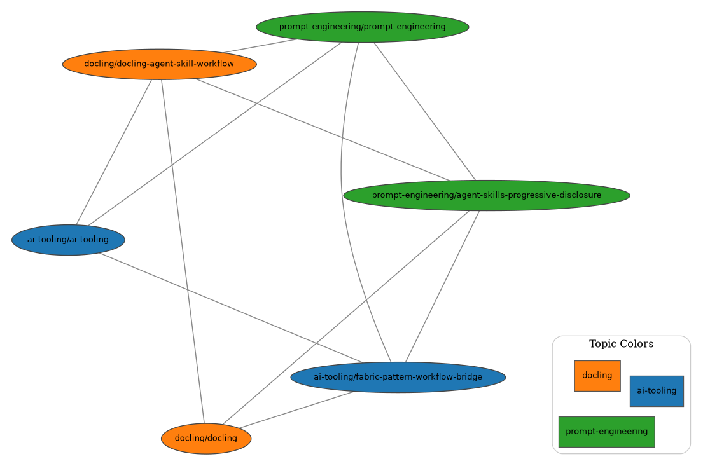

# Personal LLM Wiki

A local, markdown-first knowledge base that follows the LLM Wiki pattern:
sources are ingested into `raw/`, compiled into structured `wiki/` pages, and queried through indexes.

The repository root is the active wiki workspace.

## Wiki Connections



## Repository Layout

- `llm-wiki-overview.md` - short background on the LLM Wiki pattern.
- `AGENTS.md` - workflow and structure rules for this wiki.
- `inbox/` - intake area for new source files.
- `raw/` - normalized source markdown with frontmatter.
- `wiki/` - compiled topic pages (all concept pages directly in each topic folder).
- `tools/` - scripts for extraction, ingest, compile, query, and graphing.

## Prerequisites

- Python 3.10+
- `make`
- Optional: Graphviz (`dot`) for PNG graph export
- Optional: local OpenAI-compatible LLM endpoint for ingest/compile/query scripts

Install Python dependencies:

```bash
python3 -m pip install langchain langchain-openai
```

Docling extraction uses an isolated environment via `tools/run_docling_uv.sh`.

## Quickstart

From the repository root:

```bash
make wiki-ingest
make wiki-compile
make wiki-query QUERY="What are the key concepts?"
```

The default flow is:

1. Add files to `inbox/`
2. Run ingest to normalize sources into `raw/`
3. Run compile to generate/refresh `wiki/`
4. Run query against the compiled wiki

## LLM Configuration

The scripts in `tools/` read these environment variables:

```bash
export WIKI_LLM_BASE_URL="http://localhost:8000/v1"
export WIKI_LLM_API_KEY="dummy"
export WIKI_LLM_MODEL="gpt-oss-130b"
export WIKI_LLM_TEMPERATURE="0.1"
```

## Useful Commands

Run from the repository root:

```bash
# Extract PDFs into raw markdown via Docling
make docling-extract INPUT="inbox/*.pdf" OUTDIR="raw" TOPIC="unclassified"

# Build wiki knowledge graph artifacts
make knowledge-graph

# Query compiled wiki
make wiki-query QUERY="your question"
```

## Notes

- This project is designed as a transparent, git-tracked wiki rather than a vector database pipeline.
- Ground truth should remain anchored to source markdown in `raw/`.
- For governance and required file conventions, follow `AGENTS.md`.
